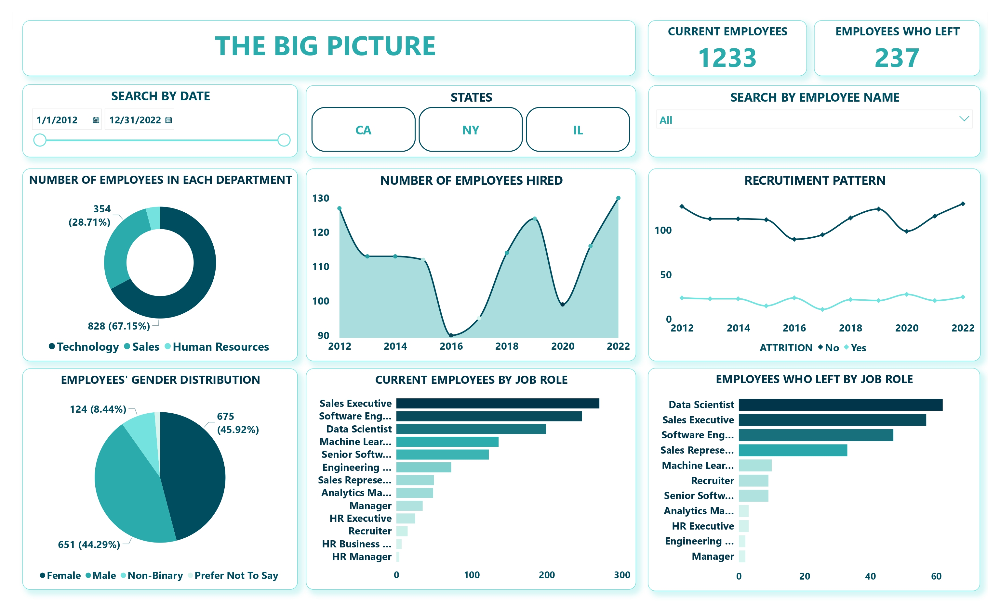
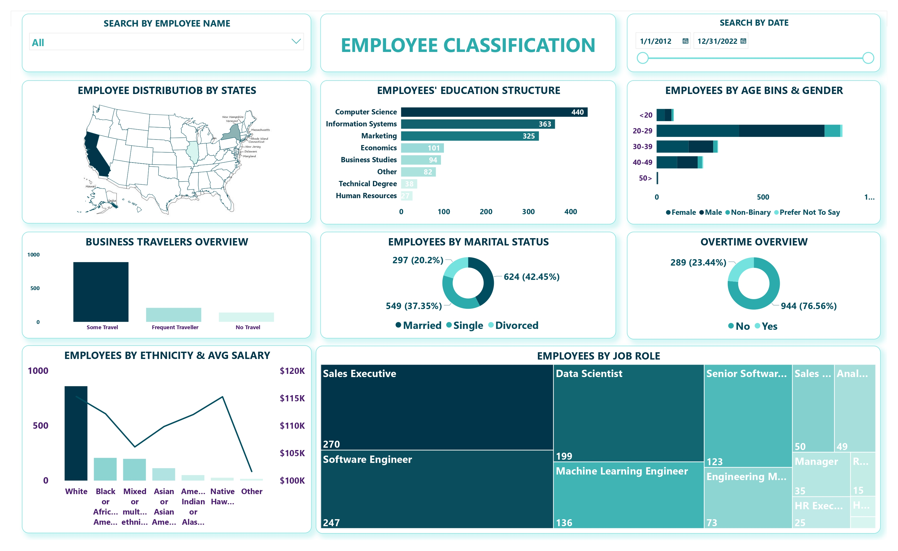
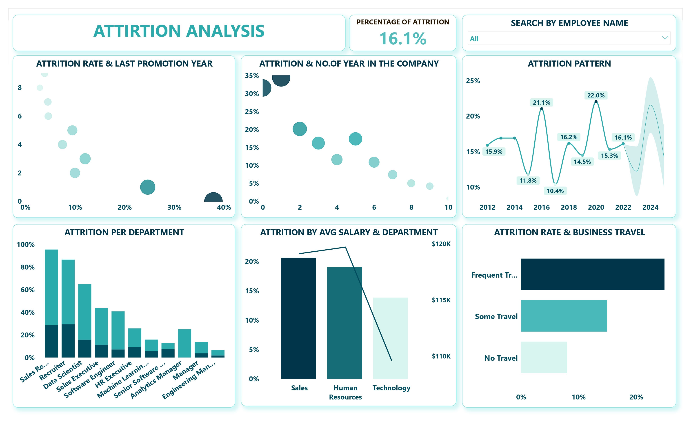
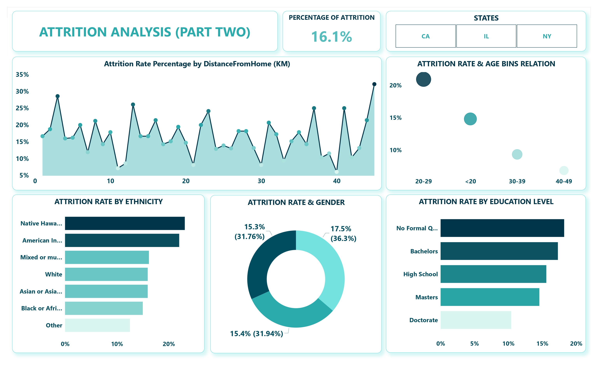
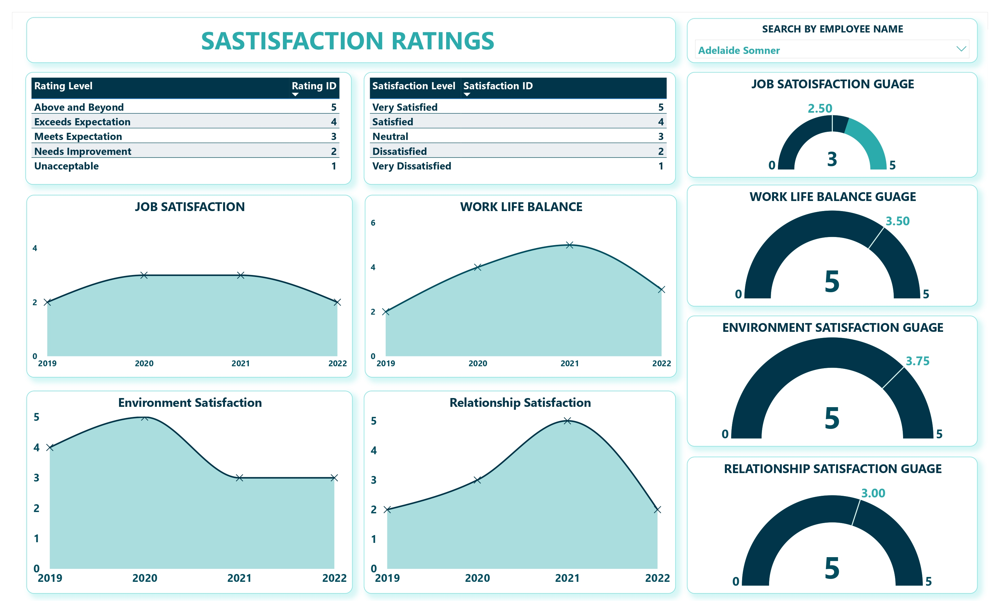
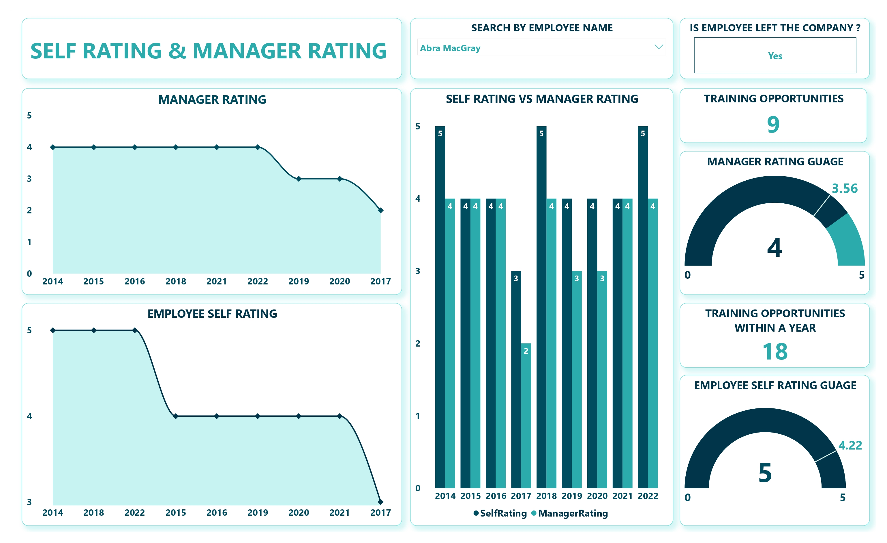

# HR Analysis Project

This repository contains the workflow and insights derived from analyzing HR trends and patterns within an organization. Using **Power BI**, we developed interactive dashboards to visualize key metrics related to employee demographics, recruitment, attrition, and satisfaction levels.

---

## Table of Contents

1. [Introduction](#introduction)
2. [Goals and Key Questions](#goals-and-key-questions)
3. [Data Sources](#data-sources)
4. [Tools and Technologies](#tools-and-technologies)
5. [Project Workflow](#project-workflow)
6. [Dashboards and Key Insights](#dashboards-and-key-insights)
   - [The Big Picture](#the-big-picture)
   - [Employee Classification](#employee-classification)
   - [Attrition Analysis (Part 1)](#attrition-analysis-part-1)
   - [Attrition Analysis (Part 2)](#attrition-analysis-part-2)
   - [Satisfaction Ratings](#satisfaction-ratings)
   - [Self & Manager Rating](#self--manager-rating)
7. [Recommendations and Future Plans](#recommendations-and-future-plans)

---

## Introduction

The workforce is the backbone of any organization, and understanding HR trends can significantly impact business success. This project aims to provide data-driven insights into various HR metrics, including demographics, attrition, and satisfaction levels, enabling organizations to make informed decisions. By leveraging Power BI, we offer a detailed view of employee patterns and opportunities for optimization.

---

## Goals and Key Questions

### Goals:
- To analyze employee demographics and identify workforce patterns.
- To evaluate factors driving employee attrition and satisfaction.
- To provide actionable insights for improving recruitment and retention strategies.

### Key Questions:
1. What are the trends in employee demographics, such as age, gender, and education?
2. What factors influence employee attrition rates, and how can they be mitigated?
3. How satisfied are employees with their work-life balance, job roles, and environment?
4. How do employees rate themselves compared to their managers' evaluations?

---

## Data Sources

The dataset used in this analysis can be downloaded here:

- [Metadata - Case Study_HR Analytics in Power BI](Data/Metadata%20-%20Case%20Study_HR%20Analytics%20in%20Power%20BI.pdf)

---

## Tools and Technologies

- **Microsoft Excel**: Used for data exploration and wrangling.
- **Power BI**: Data visualization and dashboard creation.
- **DAX (Data Analysis Expressions)**: Used for creating calculated measures and aggregations.

---

## Project Workflow

1. **Data Collection**: Gathered data from HR systems and employee records.
2. **Data Exploration and Wrangling**: Used Microsoft Excel for cleaning, filtering, and analyzing raw data.
3. **Data Modeling**: Built relationships between datasets to analyze trends effectively.
4. **DAX Calculations**: Used DAX formulas to create calculated columns and measures for aggregating data, such as attrition rates, average salaries, and satisfaction scores.
5. **Visualization**: Designed interactive dashboards in Power BI.

---

## Dashboards and Key Insights

### 1. The Big Picture

**Key Insights**:
1. Current employees: **1,233** in the company.
2. Technology department has the highest number of employees, making up **67.15%** of the total workforce.
3. The lowest hiring year was **2016**.
4. Sales Executives (**270 employees**) and Software Engineers (**247 employees**) are the top job roles with the highest number of employees.

**Dashboard Preview**:  

---

### 2. Employee Classification

**Key Insights**:
1. Most employees are based in **California**, with **875 employees** in the state.
2. The majority of employees fall within the **20-29 age group**, showing a younger workforce.
3. **Native Hawaiian** employees are the smallest group with **26 employees**, but they have the **highest average salary** in the company at **$115,274**.

**Dashboard Preview**:  

---

### 3. Attrition Analysis (Part 1)

**Key Insights**:
1. The overall attrition rate is **16.1%** across the company.
2. There is an **inverse relationship** between the number of years at the company and the attrition rate, indicating that employees with less tenure are more likely to leave.
3. **Frequent travelers** have the highest attrition rate at **24.9%**.
4. The highest attrition year was **2020**, with a rate of **22.0%**.

**Dashboard Preview**:  

---

### 4. Attrition Analysis (Part 2)

**Key Insights**:
1. Employees with no formal qualifications or education have the **highest attrition rate** at **18.2%**.
2. There is an **inverse relationship** between age groups and attrition rates, with employees aged **40-49** having the lowest attrition rate at **6.9%**.
3. The **Native Hawaiian** ethnicity group has the **highest attrition rate** at **23.1%** among all ethnicities.

**Dashboard Preview**:  

---

### 5. Satisfaction Ratings

**Key Insights**:
1. **Job Satisfaction**: Employees report varying levels of job satisfaction over time, with a noticeable trend of decline in recent years.
2. **Work-Life Balance**: Indicates a strong correlation between higher satisfaction and increased retention rates.
3. **Environment Satisfaction**: Employees with higher satisfaction levels in their work environment show lower attrition rates.
4. **Relationship Satisfaction**: Positive relationships with colleagues and supervisors improve overall engagement and performance.

**Dashboard Preview**:  

---

### 6. Self & Manager Rating

**Key Insights**:
1. **Manager Rating**: Shows a trend of consistent ratings over time, with managers generally rating employees slightly higher than self-assessments.
2. **Employee Self-Rating**: Employees tend to rate themselves lower in performance compared to managers.
3. **Self vs. Manager Ratings**: Significant gaps are observed in certain departments, indicating possible misalignments in performance expectations.
4. **Training Opportunities**: Employees with more training opportunities tend to receive higher ratings from both themselves and managers.

**Dashboard Preview**:  

---

## Recommendations and Future Plans

### Recommendations:
1. **Improve Retention for New Employees**: Focus on addressing challenges faced by employees with less tenure, as they have a higher likelihood of leaving.
2. **Enhance Diversity and Inclusion**: Monitor and address attrition factors affecting underrepresented groups, such as Native Hawaiians.
3. **Support Frequent Travelers**: Implement strategies to reduce stress and improve engagement for frequent travelers, who have the highest attrition rate.
4. **Encourage Employee Development**: Provide education and upskilling opportunities to reduce attrition among employees with no formal qualifications.
5. **Improve Work-Life Balance**: Invest in wellness programs to address declining satisfaction in work-life balance.

### Future Plans:
- Develop predictive models to forecast attrition risks based on historical trends.
- Integrate real-time employee feedback systems to track satisfaction levels.
- Expand analysis to include global workforce data for multi-regional organizations.

---

## Author

- [Ahmed Moustafa Kamal](https://github.com/ahmedmoustafa31)  
  Data Analyst and Business Intelligence developer

